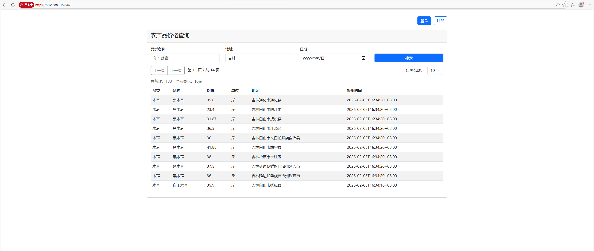
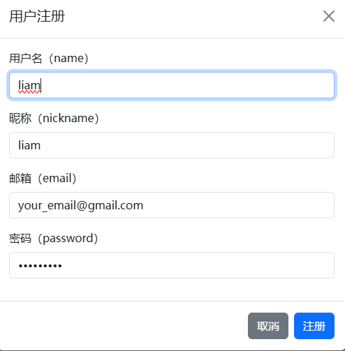
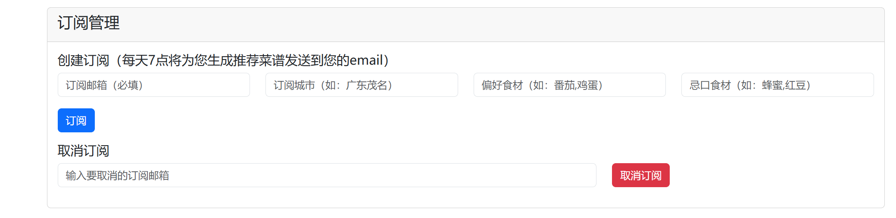
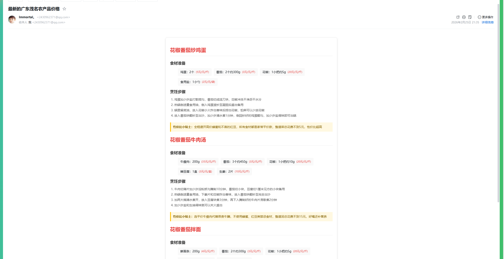

# 🌾 agri-price-crawler — 智能农产品价格监控与膳食推荐系统

[](https://golang.org)
[](LICENSE)
[](https://redis.io)
[](https://mysql.com)

> **让新鲜看得见，让餐桌更聪明**  
> 实时爬取惠农网全国农产品价格，结合 AI 推荐每日健康食谱，助你吃得新鲜、吃得划算！

---

## ✨ 核心功能

- **实时价格监控**：每日自动抓取全国农贸市场和惠农网（cnhnb.com）的最新农产品价格
- **智能订阅推送**：用户可订阅所在城市，每日接收本地市场行情简报（支持邮件）
- **AI 膳食推荐**：基于当日低价优质食材，智能生成午餐 & 晚餐搭配建议
- **数据可视化**：提供 Web 界面查看历史价格趋势、区域比价
- **高可靠反爬**：完美复现惠农网前端签名算法，稳定绕过风控

---

## 📦 技术栈

| 模块 | 技术 |
|------|------|
| 后端服务 | Go 1.24+ Gin + GORM |
| 定时任务 | Cron + 自定义调度器 |
| 数据存储 | MySQL + Redis |
| 反爬引擎 | 动态 Header 签名（SHA384 + Base36 TraceID） |
| AI 推荐 | 规则引擎 + 营养搭配模型（可扩展 LLM） |
---

## 🖼️ 项目效果展示
1. 首页价格概览
首页直观展示全国农产品价格表：


2. 注册与登录
用户需先注册账号，才能订阅价格推送服务。注册完成后，可通过登录页进行身份验证。



3. 用户注册与订阅管理
用户可通过注册页完成账号创建，随后订阅城市、设置偏好食材,每日7点推送邮件：


4. 邮件订阅成功提示
用户完成所在城市价格订阅后，系统会立即发送确认邮件，并在 Web 端展示成功页面：


---
🚀 快速开始（施工中）
>⚠️ 本章节仍在完善中，部分步骤（如生产环境部署、CI/CD 配置）尚未完成；下方列出的本地开发环境启动流程为规划版本，部分环节暂未完全验证，仅供参考。如需稳定运行，建议结合实际环境调整。
1. 环境要求
- Go 1.24+
- MySQL 8.x
- Redis 7.x

2. 克隆与配置
``` bash
git clone https://github.com/yourname/agri-price-crawler.git
cd agri-price-crawler

cp config.yaml.example config.yaml
``` 
创建 craw.pem 证书和 craw-key.pem 文件
``` bash
openssl req -x509 -newkey rsa:4096 -keyout craw-key.pem -out craw.pem -days 365 -nodes -subj "/CN=localhost"
``` 
编辑 craw.yaml 文件，配置以下关键信息：
``` yaml
# MySQL 数据库相关配置
mysql:
  host: 127.0.0.1:3306 # MySQL 机器 ip 和端口，默认 127.0.0.1:3306
  username: root # MySQL 用户名(建议授权最小权限集)
  password: 123456 # MySQL 用户密码
  database: craw # iam 系统所用的数据库名

# Redis 配置
redis:
  host: 127.0.0.1 # redis 地址，默认 127.0.0.1:6379
  port: 6379 # redis 端口，默认 6379
  password: 123456 # redis 密码


log:
    name: crawserver # Logger的名字
    development: true # 是否是开发模式。如果是开发模式，会对DPanicLevel进行堆栈跟踪。
    level: debug # 日志级别，优先级从低到高依次为：debug, info, warn, error, dpanic, panic, fatal。
    format: console # 支持的日志输出格式，目前支持console和json两种。console其实就是text格式。
    enable-color: true # 是否开启颜色输出，true:是，false:否
    disable-caller: false # 是否开启 caller，如果开启会在日志中显示调用日志所在的文件、函数和行号
    disable-stacktrace: false # 是否再panic及以上级别禁止打印堆栈信息
    output-paths: your-paths/crawserver.log,stdout # 支持输出到多个输出，逗号分开。支持输出到标准输出（stdout）和文件。 !!!
    error-output-paths: your-paths/crawserver.error.log # zap内部(非业务)错误日志输出路径，多个输出，逗号分开 !!!


cron:
  enable-daily-craw-sender: true
  enable-daily-email-sender: true
  daily-email-time: "0 7 * * *" # 每天7点发送邮件
  daily-craw-time: "0 2 * * *" # 每天2点开始爬取数据

# 爬虫配置(通过惠农网获取到的设备ID和密钥)
crawler:
  device-id: "xxxxxxxxxxxxxxxxxxxxxxxxxxxxxxxx"
  secret: "xxxxxxxxxxxxxxxxxxxxxxxxxxxxxxxx"

email:
  host: smtp.qq.com
  port: 465
  username: your_email@qq.com
  password: vmmpotyiqjlbdeib   # QQ 邮箱授权码
  from: "AgriPrice <your_email@qq.com>"


# https://doubao.apifox.cn/ Go to this website to get the api-key and base-url
doubao:
  api-key: "xxxxxxxxxxxxxxxxxxxxxxxxxxxxxxxx"
  base-url: "https://ark.cn-beijing.volces.com/api/v3"
  timeout-sec: 60
  max-retries: 3
  model: "doubao-seed-2-0-pro-260215"
```

3. 启动依赖服务
``` bash
# 启动 MySQL 和 Redis
docker-compose up -d mysql redis

# 查看服务状态
docker-compose ps
```
4. 初始化数据库
创建craw数据库
``` bash
# 先登录 MySQL 终端（会提示输入密码）
mysql -u root -p

# 登录成功后，先创建数据库（如果已存在则跳过）
CREATE DATABASE IF NOT EXISTS craw;
```
导入 craw.sql 文件
方式1：直接在 MySQL 终端导入
``` bash
mysql -u root -p

# 切换到目标数据库（必须！否则表会导入到默认数据库如 mysql 中）
USE craw;

# 导入 sql 文件（注意：这里的路径是服务器/本地的绝对路径/相对路径）
SOURCE /你的项目路径/configs/craw.sql;

# 验证是否导入成功（可选）
SHOW TABLES;  # 能看到 craw.sql 里的表名则说明导入成功
```

方式2： 通过管道直接导入（快捷方式）
在项目根目录下执行
``` bash
mysql -u root -p craw < configs/craw.sql
```

4.生成代码文件,构建项目
``` bash
# 生成代码文件
make tools # 生成工具
make gen # 生成代码
# 构建项目
go  build ./cmd/craw/crawserver.go
```

5. 启动项目
``` bash
# 启动项目
./crawserver
```


