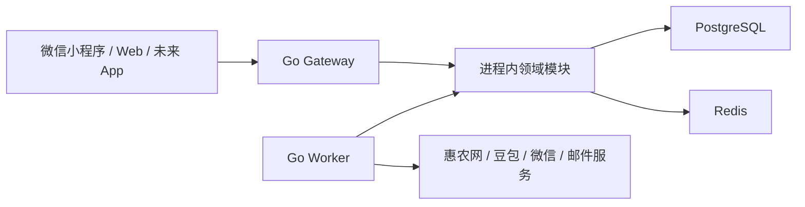
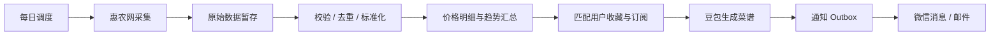

# Agri Price Crawler 后端重建设计

日期：2026-07-22
状态：已完成会话设计确认，等待书面规格审阅

## 1. 背景与目标

现有项目同时承担 HTTP、gRPC、定时采集、邮件、AI 推荐和告警等职责，存在全局客户端、启动顺序耦合、前后端接口不一致、单文件页面过大等问题。新版不兼容旧 API，也不迁移或保留旧 MySQL 业务数据，从空数据库开始建设。

本阶段只重建后端，为微信小程序、响应式 Web 和未来独立 App 提供统一 API。前端界面、独立 App 和管理后台不在本阶段范围内。

核心用户是普通消费者，产品闭环为：

1. 发现农产品价格。
2. 比较地区与历史趋势。
3. 收藏商品或创建地区、食材订阅。
4. 根据价格、偏好和忌口获取个性化菜谱。
5. 通过微信订阅消息或邮件接收提醒。

首版按正式小型产品设计，目标规模为 1–10 万用户、每日价格记录不超过百万级。系统应支持单机或少量实例部署，并保留未来水平扩展与服务拆分能力。

## 2. 总体架构

采用“模块化单体 + Gateway/Worker 双进程”架构。同一 Go 代码仓库构建两个程序：

- `gateway`：微信小程序、Web 和未来 App 的统一入口/BFF，负责路由、认证、限流、请求校验、响应编排、API 契约、请求日志和基础指标。
- `worker`：执行每日价格采集、数据清洗、趋势汇总、菜谱生成、消息投递和失败重试。

Gateway 不包含业务规则。业务规则由进程内领域模块实现，模块通过明确的应用接口协作。未来拆分服务时，可将进程内接口适配器替换为 HTTP 或 gRPC 客户端，而不改变对外 API。

PostgreSQL 是唯一业务事实来源。Redis 只保存邮箱验证码、限流计数和可重建缓存，不保存必须持久化的业务状态。

## 3. 模块边界

### 3.1 Identity

负责用户、微信身份、邮箱身份、账户绑定、验证码验证和会话管理。微信身份与邮箱身份可以绑定到同一用户，未来独立 App 复用同一账户模型。

绑定新身份时，用户必须同时证明当前会话和待绑定身份。若两个身份已属于不同账户，则在双重验证后将创建时间更早的账户作为主账户，合并并去重收藏、订阅和通知偏好，撤销两个账户的现有会话，再签发主账户的新会话。系统不允许在未验证两种身份的情况下自动合并账户。

### 3.2 Pricing

负责标准农产品、品类、地区、每日价格、当前价格快照和日级趋势汇总。价格明细按月份分区，以日期、标准商品和地区建立查询索引。列表查询使用当前快照，趋势查询使用日级汇总，避免重复扫描原始记录。

### 3.3 Ingestion

负责数据源适配、采集批次、原始记录、字段校验、商品和地区标准化、去重及批次发布。首版只实现惠农网适配器，但适配器接口不得依赖惠农网特有结构。

原始响应保留 30 天用于排障，随后由维护任务删除；标准化历史价格长期保留。只有采集批次完成基本字段校验和重复检查后，才以事务发布为新的当前价格批次。失败批次不能覆盖上一批有效数据。

### 3.4 Subscription

负责商品收藏、地区与食材订阅、饮食偏好、忌口和通知渠道选择。微信订阅消息与邮件可以分别开启或关闭。

### 3.5 Recipe

负责菜谱推荐任务、生成结果、食材匹配、模型信息和提示词版本。首版使用豆包，通过供应商接口隔离具体模型。生成结果保存模型标识、提示词版本和输入摘要，以便追踪问题和未来切换供应商。

### 3.6 Notification

负责微信订阅消息、邮件模板、投递记录和有限重试。投递状态必须持久化，避免重复发送并支持排查失败原因。

### 3.7 Platform

负责配置、数据库迁移、后台任务、事务 Outbox、日志、指标、健康检查和通用错误模型。Platform 不能反向依赖任何业务模块。

各模块拥有自己的表与迁移目录。首版可部署在同一个 PostgreSQL 数据库中，但其他模块不能越过公开应用接口直接读写不属于自己的表。

## 4. 核心数据流

每日调度器以 Asia/Shanghai 时区在 04:00 创建带日期唯一键的采集任务。Worker 执行惠农网采集，将原始记录写入采集批次，经过校验、去重和标准化后发布价格数据，并更新当前快照及趋势汇总。每日订阅通知从 07:00 开始创建；当天采集尚未成功时，不发送引用过期价格的菜谱通知，而是等待采集任务完成或在当天 12:00 将本次通知标记为跳过。

成功发布价格批次后，系统匹配用户收藏和订阅，创建菜谱生成任务。菜谱完成后，通过事务 Outbox 创建微信消息和邮件投递任务。所有写入操作使用业务唯一键保证重复执行不会重复写价格、生成同一份每日菜谱或重复发送通知。

首版每天更新一次价格。采集失败会保留上一批有效价格，Gateway 返回数据更新时间和是否延迟，不把旧数据伪装成最新数据。

## 5. Gateway API 与认证

所有客户端使用统一、版本化的 REST API，前缀为 `/api/v1`。OpenAPI 文件是接口唯一契约，并用于生成客户端类型和校验实现一致性。

主要资源包括：

- `/auth/*`：微信登录、邮箱验证码登录、刷新会话、退出和账户绑定。
- `/products`、`/regions`：标准商品和地区检索。
- `/prices/current`、`/prices/trends`：当前价格、地区比较和历史趋势。
- `/me/favorites`：当前用户收藏。
- `/me/subscriptions`：价格与菜谱订阅、饮食偏好和忌口。
- `/me/recipes`：菜谱历史、生成任务和任务结果。
- `/me/notification-preferences`：微信订阅消息和邮件开关。
- `/home`：为小程序和 Web 聚合首页所需数据，减少客户端请求次数。

列表接口使用游标分页。创建订阅、触发菜谱等可能被客户端重试的写操作支持 `Idempotency-Key`。菜谱生成返回 `202 Accepted` 和任务 ID，客户端通过查询任务状态获取结果。

小程序将微信临时登录凭证交给 Gateway，由后端向微信换取身份。Web 使用邮箱验证码登录。邮箱验证码有效期为 10 分钟，同一验证码最多尝试 5 次，同一邮箱 60 秒内不能重复发送；更严格的 IP 与邮箱小时级限额通过可配置限流规则执行。

Access Token 使用有效期 15 分钟的 JWT。Refresh Token 是有效期 30 天的随机不透明令牌，数据库只保存其哈希，并在刷新时轮换。退出登录或发现异常会话时可撤销会话。

错误响应采用 Problem Details 格式，包含稳定错误码、请求追踪 ID 和可安全展示的中文提示。领域权限和业务校验由对应模块执行，Gateway 只做通用认证、输入校验和响应编排。

## 6. 后台任务与异常处理

首版采用精简的 PostgreSQL 持久化任务机制，不引入独立消息队列。任务至少记录类型、业务唯一键、载荷、计划时间、尝试次数、状态和最后错误。

Worker 使用 PostgreSQL 行锁安全领取到期任务。任务成功后标记完成；网络超时、限流或外部服务 5xx 最多重试三次，并使用指数退避。参数错误、认证失效和确定无法恢复的数据错误不自动重试，直接记录失败并告警。

系统不在首版实现复杂死信管理界面、AI 规则降级引擎、数据质量评分、自动识别数据源结构变化或完整分布式追踪。豆包不可用且重试失败时，推荐任务明确标记失败，允许用户稍后重新发起。

Redis 不可用时，邮箱验证码登录、限流和缓存暂时不可用；价格查询、已有有效会话及 PostgreSQL 中的持久化业务仍可继续工作。

## 7. 技术基线

- 使用 Go 构建模块化单体，采用手工构造函数完成依赖注入，不使用全局客户端。
- Gateway 基于标准 `net/http` 和轻量路由层，领域与应用代码不得依赖 HTTP 框架。
- PostgreSQL 使用显式 SQL 与类型安全的数据访问层，数据库记录结构不得直接充当领域对象。
- 数据库迁移由独立命令执行；Gateway 和 Worker 启动时只检查迁移版本，不自动修改生产数据库。
- 配置来自环境变量。密钥、验证码、Token 原文和外部服务凭据不得进入日志或仓库。
- Docker Compose 提供 Gateway、Worker、PostgreSQL 和 Redis；生产环境使用与开发环境相同的应用镜像。
- 提供结构化日志、存活与就绪检查，以及采集状态、任务积压、外部调用失败率和数据库连接等基础 Prometheus 指标。

## 8. 测试与验收

测试体系包括：

- 领域单元测试：账户绑定、价格标准化、订阅匹配等核心规则。
- 应用服务测试：通过 Fake Repository 验证业务流程与错误处理。
- 数据库集成测试：使用临时 PostgreSQL 和 Redis 验证迁移、查询、事务与任务并发领取。
- 采集器契约测试：使用脱敏惠农网响应样本，不让 CI 依赖真实网站。
- Gateway API 测试：验证 OpenAPI、认证、权限、分页、幂等与错误格式。
- Worker 测试：验证重试与重复执行不会产生重复业务结果。
- 端到端测试：覆盖“登录、查询价格、收藏订阅、生成菜谱、发送通知”的核心闭环；外部服务使用受控替身。

CI 必须执行格式检查、静态分析、单元与集成测试、竞态检测、迁移验证，以及 Gateway、Worker 和 Docker 镜像构建。

后端首版验收条件：

1. Docker Compose 可从空环境启动 PostgreSQL、Redis、Gateway 和 Worker。
2. 新数据库可通过迁移完整初始化，无需任何旧 MySQL 数据。
3. 每日采集失败不会覆盖上一批有效价格，重跑同一日期任务不会产生重复记录。
4. 微信身份与邮箱身份可登录并绑定到同一账户。
5. 用户可查询价格和趋势、管理收藏订阅、请求菜谱并配置两种通知渠道。
6. 核心闭环端到端测试通过，Gateway 与 Worker 可独立扩容。

## 9. 重建与替换策略

新版先以新的目录结构和启动入口并行建设，保持仓库在重建过程中可构建。实施顺序为：

1. 建立 Gateway、Worker、模块骨架、配置与 PostgreSQL 迁移。
2. 完成 Identity、Pricing 和 Ingestion 闭环。
3. 完成 Subscription、Recipe 和 Notification 闭环。
4. 运行完整测试并通过 Docker Compose 验收。
5. 切换默认启动入口与部署配置。
6. 删除旧 MySQL 模型、迁移、依赖、服务入口和旧实现。

不编写旧数据迁移程序，也不保留旧 API 兼容层。实际下线或清除旧 MySQL 实例前，必须核对具体实例与数据库名称，防止影响不属于本项目的数据。

## 10. 明确不在首版范围内的事项

- 微信小程序和响应式 Web 的界面实现。
- 独立 iOS/Android App。
- 管理后台和复杂运营系统。
- 多价格数据源、多 AI 模型和自动供应商切换。
- 微服务部署、独立消息队列和 Kubernetes 清单。
- 实时价格采集、复杂数据质量评分和分布式链路追踪。
- 旧 MySQL 数据迁移和旧 API 兼容。
